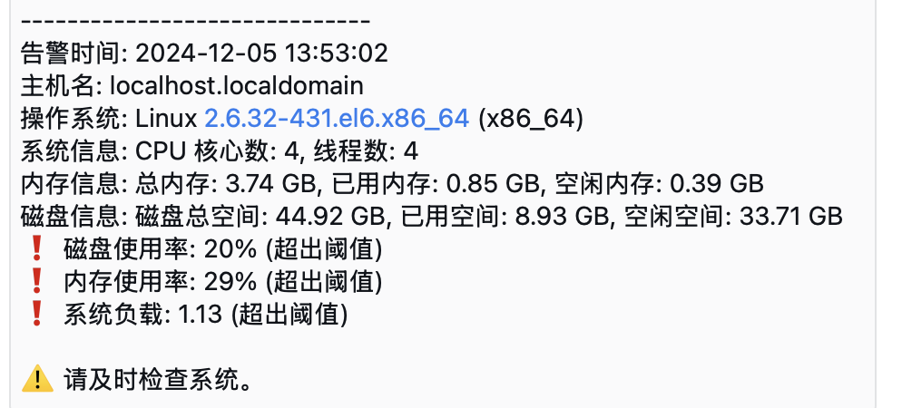

## 【Enilish】
## Python Linux Server Monitoring and WeChat Work Alert System

### Description:
The script sends an alert message via WeChat Work Webhook when the disk usage, memory usage, CPU usage, or system load exceeds the specified threshold (default 80%).

### Deployment Path: (Customizable)
/var/www/

### Deployment Steps:
1. **Create Deployment Directory:**
   - Create a directory to store the monitoring script:
     ```
     mkdir /var/www/PythonSysMonAlert
     ```
2. **Copy Script Files:**
   - Copy the script file to the deployment directory:
     ```
     cp disk_check.py /var/www/PythonSysMonAlert/
     ```
3. **Edit Script File:**
   - Edit the script file to modify the following parameters according to your actual situation:
     - `WEBHOOK_URL`: WeChat Work Webhook URL.
     - `SERVER_NAME`: Server name.
     - Threshold settings: Modify the following thresholds as needed:
       - `DISK_USAGE_THRESHOLD`: Disk usage threshold (default 80%).
       - `MEMORY_USAGE_THRESHOLD`: Memory usage threshold (default 80%).
       - `CPU_USAGE_THRESHOLD`: CPU usage threshold (default 80%).
       - `SYSTEM_LOAD_THRESHOLD`: System load threshold (default 80%).
   - Save and exit after editing.

### Dependency Installation:
Before running the script, you need to install the necessary Python libraries. You can install the dependencies with the following command:
```
cd PythonSysMonAlert/
pip install -r requirements.txt
```
Python Version Note:
- If using Python 2, run:
  ```
  python2 disk_check.py
  ```
- If using Python 3, run:
  ```
  python3 disk_check.py
  ```

### Setting Up Cron Job:
After the project is successfully running, edit the crontab to set up a scheduled task:
- Use `crontab -e` to edit and add the following line in the editor:
  - Test scheduled task (runs every minute for testing, outputs to log file `disk_check.log`):
    ```
    * * * * * /usr/bin/python /var/www/PythonSysMonAlert/disk_check.py >> /var/www/PythonSysMonAlert/disk_check.log 2>&1
    ```
  - `/usr/bin/python`: Specifies the Python version to run the script (modify to the correct Python path as needed).
  - `/var/www/PythonSysMonAlert/disk_check.py`: Specifies the path of the Python script to be executed.
  - `>> /var/www/PythonSysMonAlert/disk_check.log 2>&1`: Redirects output and error logs to the specified log file.

### Summary:
This script is used for disk usage monitoring and sends alerts via WeChat Work Webhook.
Setting up a scheduled task allows the script to run automatically, ensuring regular monitoring of disk usage.
Logging the monitoring results facilitates later review and debugging.

## ------------------------------------------------------------------------------------------------------------------------------------------------------

## 【中文】
## python检测linux服务器系统信息企微告警

## 说明： 
当磁盘使用率\内存使用率\cpu\负载超过指定的阈值（默认 80%）时，脚本会通过企业微信 Webhook 发送告警信息。

## 部署路径：（可自定义路径）
/var/www/

## 部署步骤：
创建部署目录： 
创建一个目录用于存放监控脚本： 
mkdir /var/www/PythonSysMonAlert
将脚本文件复制到部署目录： 
将脚本文件复制到部署目录： 
cp disk_check.py /var/www/PythonSysMonAlert/
编辑脚本文件： 
编辑脚本文件，根据实际情况修改以下参数： 
WEBHOOK_URL：企业微信 Webhook URL。
SERVER_NAME：服务器名称。
阈值设置：根据实际情况修改以下阈值设置：
DISK_USAGE_THRESHOLD：磁盘使用率阈值（默认 80%）。
MEMORY_USAGE_THRESHOLD：内存使用率阈值（默认 80%）。
CPU_USAGE_THRESHOLD：CPU 使用率阈值（默认 80%）。
SYSTEM_LOAD_THRESHOLD：系统负载阈值（默认 80%）。
编辑完成后保存并退出。

## 依赖安装：
在执行脚本之前，需要安装必要的 Python 库。你可以通过以下命令安装依赖：
cd PythonSysMonAlert/
pip install -r requirements.txt
Python 版本说明：
如果使用 Python 2，请运行以下命令：
python2 disk_check.py
如果使用 Python 3，请运行以下命令：
python3 disk_check.py

项目运行成功后，编辑 crontab 设置定时任务：

使用 crontab -e 编辑器添加定时任务。在编辑器中添加以下行：
测试定时任务（每分钟执行一次，用于测试脚本），会输出日志文件disk_check.log：
* * * * * /usr/bin/python /var/www/PythonSysMonAlert/disk_check.py >> /var/www/PythonSysMonAlert/disk_check.log 2>&1

/usr/bin/python：指定使用 Python 版本运行脚本（请根据实际情况修改为正确的 Python 路径）。
/var/www/PythonSysMonAlert/disk_check.py：指定要执行的 Python 脚本路径。
>> /var/www/PythonSysMonAlert/disk_check.log 2>&1：将输出和错误日志重定向到指定的日志文件。 

## 总结：
本脚本用于磁盘使用率监控，并通过企业微信 Webhook 发送告警。
设置定时任务可以自动执行该脚本，确保定期监控磁盘使用情况。
通过日志记录监控结果，方便后期检查和调试。 


